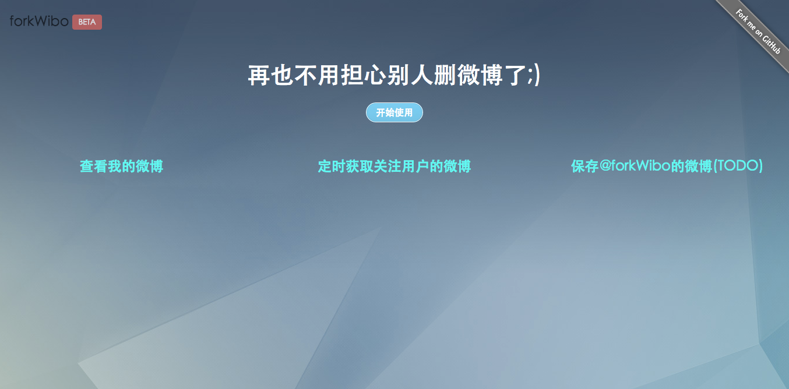
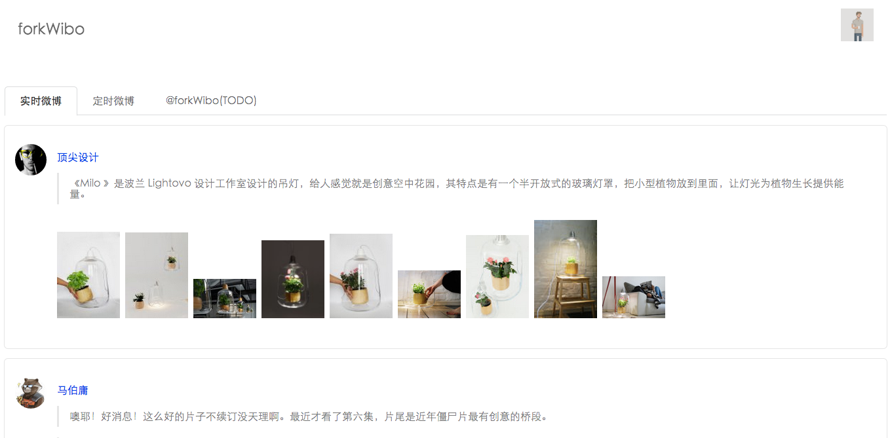
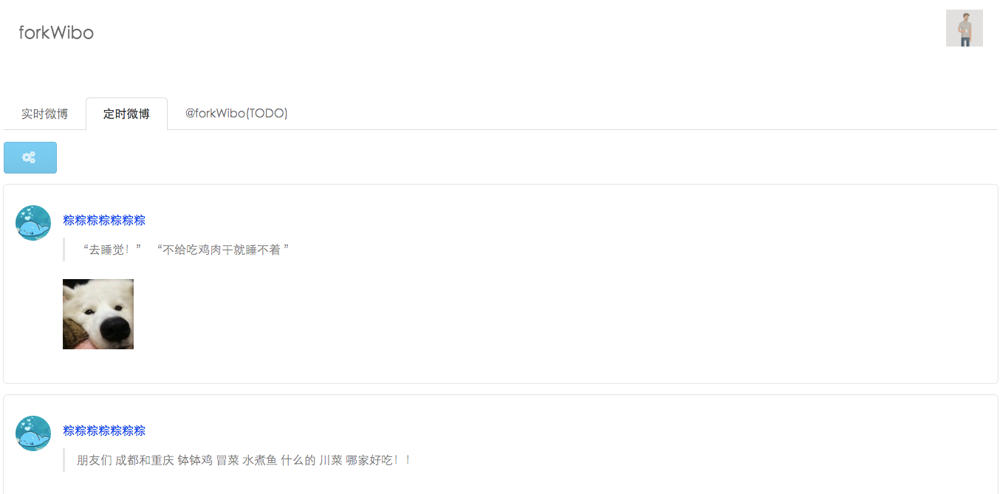
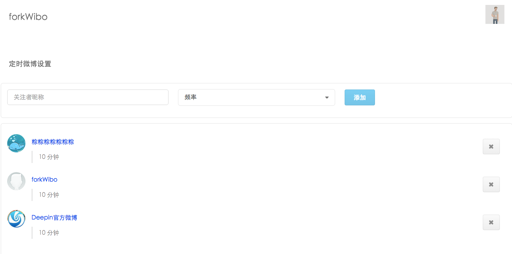

##forkWibo

####Notice

forkWibo 没能通过新浪审核，不允许除测试帐号之外的其他帐号授权使用 ;(

如需使用，请查看源码，自己搭建应用 OR 微博@jsxqf 让我帮你加到测试帐号中。

####展示

####依赖

[slim](https://github.com/codeguy/Slim)
	
[semantic-ui](https://github.com/semantic-org/semantic-ui/)
	
[httpful](https://github.com/nategood/httpful)
	
[idiorm](https://github.com/j4mie/idiorm)
	
[jQuery](https://github.com/jquery/jquery)
	
[handlebars](https://github.com/wycats/handlebars.js)
	
`composer install` 安装PHP相关依赖

####注意

`config.yaml`

配置 URL Rewrite 和定时任务设置，只用于SAE

API Key\Secret 需向新浪申请

####License

GPLv3

